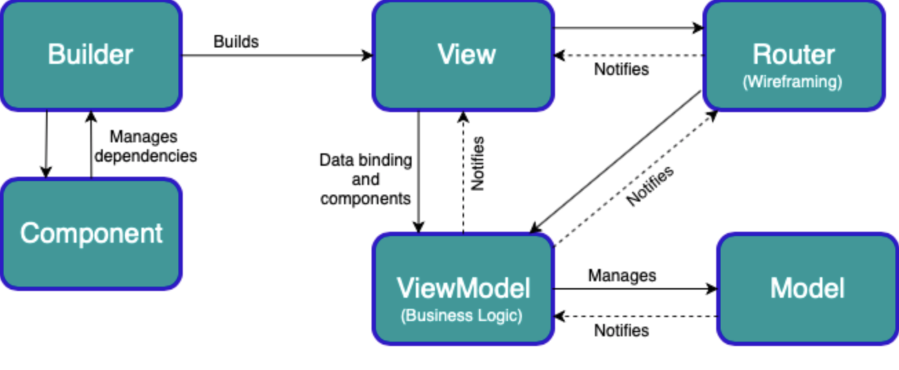

# MVVMRB
MVVM+RB — What’s The RB & Why needed?
The RB stands for “Router & Builder”. The group of classes representing one screen in MVVM+RB is composed of the Model, View, ViewModel, Router, and Builder.




## Installation

```ruby
pod 'MVVMRB'
```
